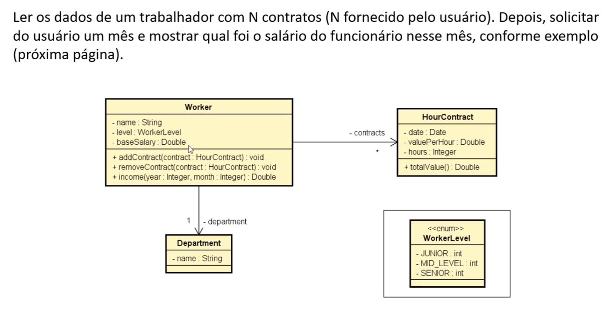

# Atividade: Cálculo de Renda de Trabalhador com Contratos Horistas

## Enunciado

Ler os dados de um trabalhador com N contratos (N fornecido pelo usuário).  
Depois, solicitar do usuário um mês e mostrar qual foi o salário do funcionário nesse mês.

### Diagrama de Classes

### Estrutura esperada:

- `Worker`  
  - Atributos: `name`, `level`, `baseSalary`  
  - Métodos: `addContract`, `removeContract`, `income`

- `Department`  
  - Atributo: `name`

- `HourContract`  
  - Atributos: `date`, `valuePerHour`, `hours`  
  - Método: `totalValue`

- `WorkerLevel` (enum)  
  - Valores: `JUNIOR`, `MID_LEVEL`, `SENIOR`

## Objetivo

Simular um sistema que calcula o salário de um trabalhador (com salário base e contratos de hora extra) em um determinado mês.
