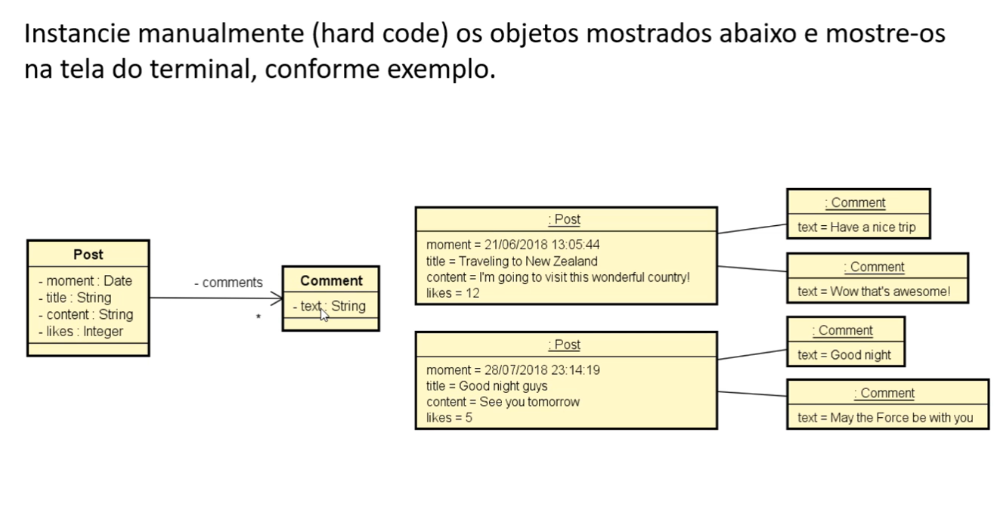

# Atividade: Postagens com Comentários

## Enunciado

Instanciar manualmente (**hard code**) os objetos mostrados e exibir no terminal conforme exemplo.  

Cada postagem (`Post`) deve conter:
- `moment`: data e hora da postagem  
- `title`: título  
- `content`: conteúdo do post  
- `likes`: número de curtidas  
- `comments`: lista de comentários (`Comment`)

Cada comentário deve conter:
- `text`: texto do comentário

## Objetivo

Demonstrar composição de objetos em Java (um `Post` com múltiplos `Comment`), encapsulamento e exibição formatada de dados.

## Diagrama de Classes

## Exemplo de Saída

21/06/2018 13:05:44
Traveling to New Zealand
I'm going to visit this wonderful country!
Likes - 12
Comments:
Have a nice trip
Wow that's awesome!

28/07/2018 23:14:19
Good night guys
See you tomorrow
Likes - 5
Comments:
Good night
May the Force be with you