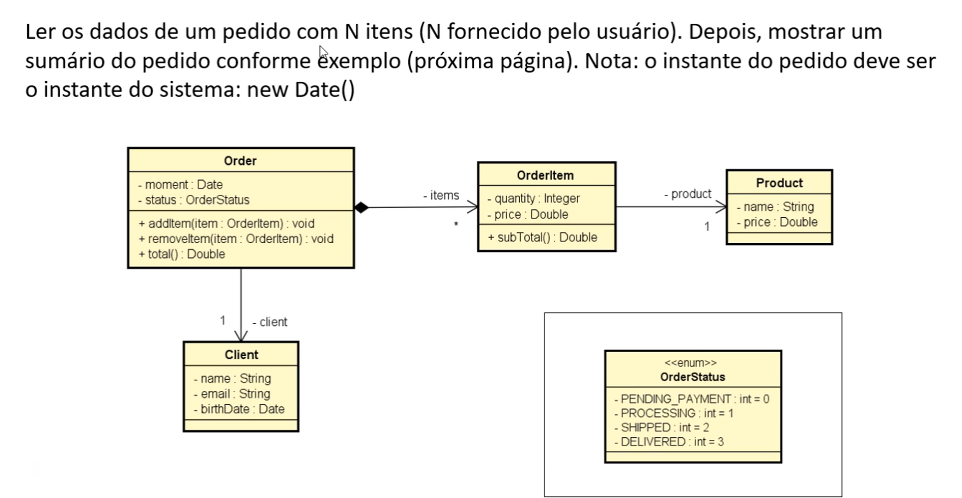

# Atividade: Sistema de Pedido com Itens e Cliente

## Enunciado

Ler os dados de um pedido com **N itens** (N fornecido pelo usuário).  
Depois, mostrar um **sumário do pedido** conforme exemplo.

- O instante do pedido deve ser o instante do sistema (`new Date()`).
- O pedido deve estar vinculado a um cliente (`Client`) e conter múltiplos itens (`OrderItem`).
- Cada item está associado a um produto (`Product`).

## Objetivo

Aplicar conceitos de composição de objetos em Java e enumerações, modelando um sistema de pedido com cliente, produtos, itens e status.

## Diagrama de Classes

## Componentes

- `Client`: nome, email e data de nascimento.
- `Product`: nome e preço.
- `OrderItem`: quantidade, preço e subtotal.
- `Order`: data do pedido, status (`OrderStatus`), cliente, lista de itens.
- `OrderStatus`: enum com valores `PENDING_PAYMENT`, `PROCESSING`, `SHIPPED`, `DELIVERED`.

## Funcionalidades Esperadas

- Instanciar um cliente com dados fornecidos.
- Criar um pedido com o status selecionado.
- Adicionar N itens ao pedido com produto, preço e quantidade.
- Exibir sumário com:
  - Data e status do pedido
  - Dados do cliente
  - Detalhamento dos itens (nome, preço, quantidade, subtotal)
  - Total do pedido

