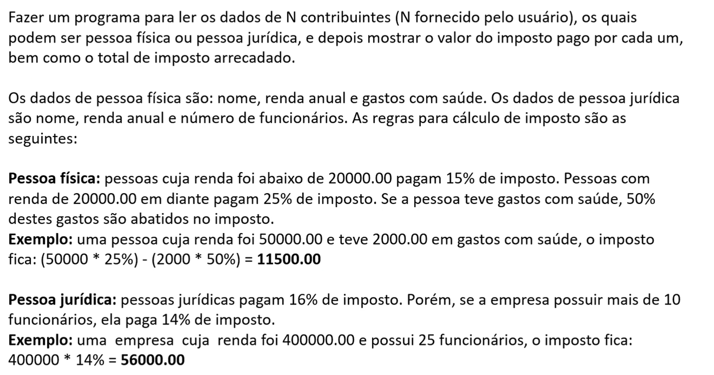

# 💰 Sistema de Cálculo de Impostos

Este projeto em Java implementa um programa que calcula o imposto a ser pago por diferentes tipos de contribuintes — pessoas físicas e jurídicas — de acordo com regras específicas. Ao final, o sistema também exibe o total de impostos arrecadados.

## 📋 Enunciado da Atividade

Abaixo está o enunciado completo da atividade com as regras de cálculo:



## ✅ Requisitos do Sistema

- O programa deve ler os dados de **N contribuintes**, sendo `N` fornecido pelo usuário.
- Cada contribuinte pode ser:
    - **Pessoa física**
        - Dados: nome, renda anual, gastos com saúde
        - Cálculo do imposto:
            - Renda < 20000.00 → 15%
            - Renda >= 20000.00 → 25%
            - 50% dos gastos com saúde são abatidos do imposto
    - **Pessoa jurídica**
        - Dados: nome, renda anual, número de funcionários
        - Cálculo do imposto:
            - Até 10 funcionários → 16%
            - Mais de 10 funcionários → 14%

- O sistema deve mostrar:
    - Imposto pago por cada contribuinte
    - Total de impostos arrecadados

## 🧱 Estrutura de Classes (sugestão)

- **TaxPayer** (classe abstrata)
    - `name : String`
    - `annualIncome : double`
    - `tax() : double` (método abstrato)

- **Individual** (herda de `TaxPayer`)
    - `healthExpenditures : double`
    - Implementa `tax()` com base nas regras da pessoa física

- **Company** (herda de `TaxPayer`)
    - `numberOfEmployees : int`
    - Implementa `tax()` com base nas regras da pessoa jurídica

## 💻 Exemplo de Entrada e Saída

```text
Enter the number of tax payers: 3

Tax payer #1 data:
Individual or company (i/c)? i
Name: Alex
Annual income: 50000.00
Health expenditures: 2000.00

Tax payer #2 data:
Individual or company (i/c)? c
Name: SoftTech
Annual income: 400000.00
Number of employees: 25

Tax payer #3 data:
Individual or company (i/c)? i
Name: Bob
Annual income: 12000.00
Health expenditures: 1000.00

TAXES PAID:
Alex: $11500.00
SoftTech: $56000.00
Bob: $1300.00

TOTAL TAXES: $68800.00
