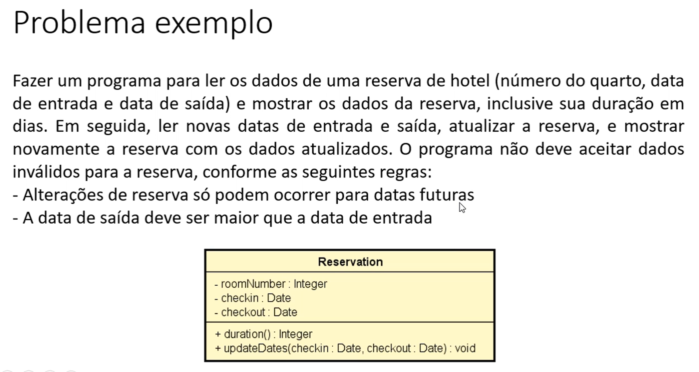

# 🏨 Sistema de Reserva de Hotel

Este projeto em Java implementa um sistema simples de reservas de hotel. Ele permite cadastrar uma reserva com número do quarto, data de entrada e data de saída, além de atualizar a reserva, respeitando regras de integridade de dados.

## 📋 Enunciado da Atividade

O programa deve:

- Ler os dados de uma reserva:
  - Número do quarto
  - Data de entrada
  - Data de saída
- Mostrar os dados da reserva, incluindo a **duração em dias**
- Em seguida:
  - Ler **novas datas**
  - Atualizar a reserva
  - Exibir os dados atualizados
- **Validações obrigatórias**:
  - Alterações só podem ser feitas com **datas futuras**
  - A **data de saída deve ser maior que a data de entrada**

## 🖼️ Enunciado com Diagrama UML



## 🧱 Estrutura da Classe `Reservation`

- `roomNumber : Integer`
- `checkin : Date`
- `checkout : Date`
- `duration() : Integer` – retorna a duração da estadia em dias
- `updateDates(checkin : Date, checkout : Date) : void` – atualiza as datas da reserva com validação

## ✅ Exemplo de Execução

```text
Room number: 802
Check-in date (dd/MM/yyyy): 15/08/2025
Check-out date (dd/MM/yyyy): 20/08/2025

Reservation: Room 802, check-in: 15/08/2025, check-out: 20/08/2025, 5 nights

Enter data to update the reservation:
Check-in date (dd/MM/yyyy): 16/08/2025
Check-out date (dd/MM/yyyy): 22/08/2025

Reservation: Room 802, check-in: 16/08/2025, check-out: 22/08/2025, 6 nights
```

## ⚠️ Validações

- Se o usuário tentar atualizar para datas **anteriores à data atual**, o programa deve exibir uma **mensagem de erro**.
- Se a **data de saída não for posterior** à de entrada, também deve ser rejeitada com erro.

## 🚀 Como Executar

1. Compile com `javac Reservation.java Program.java`
2. Execute com `java Program`
3. Insira os dados conforme solicitado
