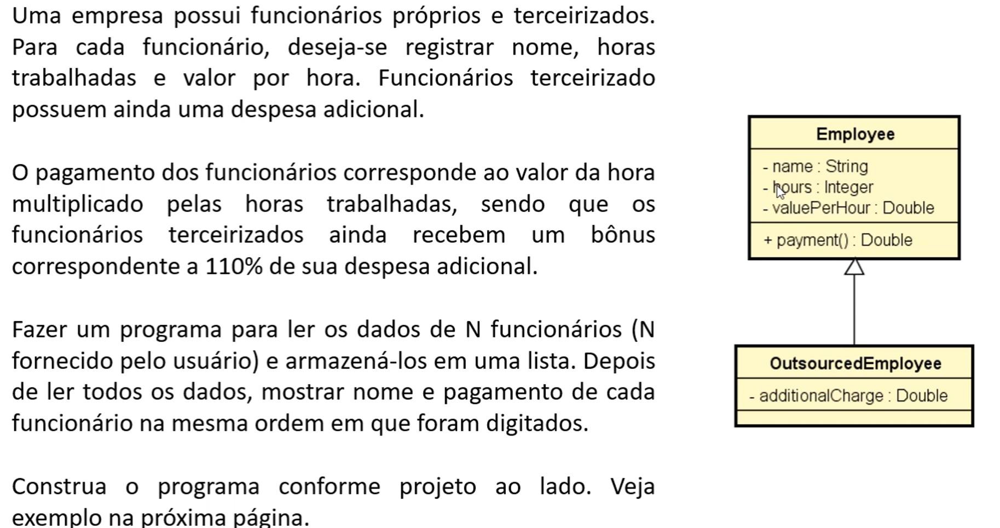

# 💼 Sistema de Pagamento de Funcionários

Este projeto implementa um programa simples em Java para calcular o pagamento de funcionários de uma empresa, considerando tanto funcionários próprios quanto terceirizados.

## 📝 Enunciado da Atividade

Abaixo está o enunciado e o diagrama UML fornecidos para orientar a implementação:

## ✅ Requisitos do Sistema

- Ler os dados de **N funcionários**, fornecido pelo usuário.
- Registrar para cada funcionário:
    - Nome
    - Horas trabalhadas
    - Valor por hora
- Funcionários terceirizados também possuem uma **despesa adicional**.
- O cálculo do pagamento:
    - Funcionários normais: `horas * valor por hora`
    - Funcionários terceirizados: `horas * valor por hora + 110% da despesa adicional`
- Exibir o **nome** e **pagamento** de cada funcionário na ordem de entrada.

## 🧱 Estrutura Orientada a Objetos

O programa foi estruturado com base no seguinte modelo UML:

- `Employee` (classe base)
    - `name : String`
    - `hours : Integer`
    - `valuePerHour : Double`
    - `payment() : Double`
- `OutsourcedEmployee` (herda de `Employee`)
    - `additionalCharge : Double`
    - Sobrescreve o método `payment()`.

## 🚀 Como executar

1. Compile os arquivos `.java` com o `javac`.
2. Execute o programa com `java`.
3. Insira os dados conforme solicitado no terminal.
4. Veja o resultado dos pagamentos calculados.

