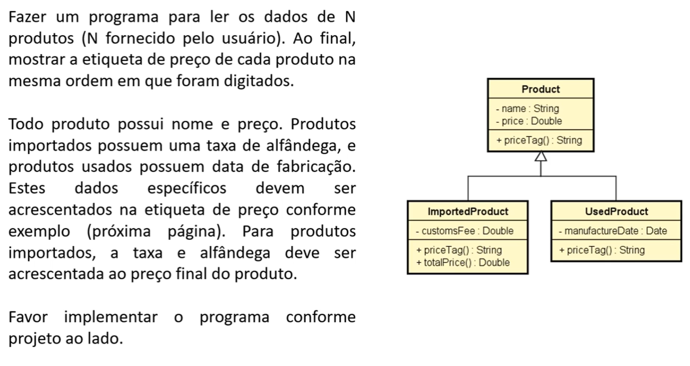

# 🛒 Sistema de Etiqueta de Produtos

Este projeto implementa um programa em Java que lê os dados de uma lista de produtos (comuns, usados e importados) e exibe a etiqueta de preço de cada um, com as informações específicas de acordo com seu tipo.

## 📋 Enunciado da Atividade

Abaixo está o enunciado completo com o diagrama UML da estrutura orientada a objetos que deve ser implementada:

## ✅ Requisitos do Sistema

- O programa deve ler os dados de **N produtos**, sendo `N` fornecido pelo usuário.
- Cada produto possui:
    - Nome
    - Preço
- Produtos **importados**:
    - Possuem uma **taxa de alfândega**, que deve ser somada ao preço.
    - Exibir etiqueta no formato: `nome (importado) $preço_final (Taxa: $taxa)`
- Produtos **usados**:
    - Possuem **data de fabricação**.
    - Exibir etiqueta no formato: `nome (usado) $preço (Data de fabricação: DD/MM/AAAA)`
- Ao final, mostrar a etiqueta de cada produto na ordem em que foram digitados.

## 🧱 Estrutura Orientada a Objetos

O modelo segue a estrutura UML abaixo:

- `Product` (classe base)
    - `name : String`
    - `price : Double`
    - `priceTag() : String`
- `ImportedProduct` (herda de `Product`)
    - `customsFee : Double`
    - `totalPrice() : Double`
    - sobrescreve `priceTag()`
- `UsedProduct` (herda de `Product`)
    - `manufactureDate : Date`
    - sobrescreve `priceTag()`

## 🚀 Como Executar

1. Compile os arquivos `.java` com `javac`.
2. Execute o programa com `java`.
3. Insira os dados dos produtos conforme solicitado.
4. Veja o resultado das etiquetas de preço no terminal.

---

