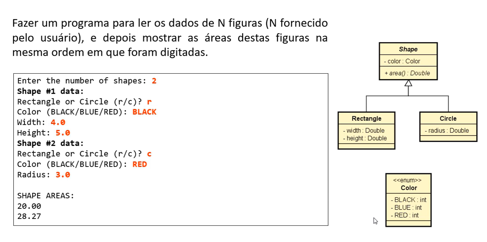

# 🔷 Sistema de Cálculo de Áreas de Figuras

Este projeto em Java implementa um programa orientado a objetos que lê os dados de diversas figuras (retângulos e círculos), calcula e exibe a área de cada uma delas na mesma ordem em que foram inseridas.

## 📌 Enunciado da Atividade

O programa deve:

- Ler os dados de **N figuras** (N fornecido pelo usuário).
- Para cada figura, ler:
    - Tipo: **Retângulo** ou **Círculo**
    - Cor: **BLACK**, **BLUE** ou **RED**
    - Medidas (largura e altura ou raio)
- Ao final, exibir a **área** de cada figura na mesma ordem da entrada.

## 🖼️ Enunciado com Diagrama UML



## 🧱 Estrutura de Classes

- **Shape** (classe abstrata)
    - `color : Color`
    - `area() : double` (método abstrato)

- **Rectangle** (herda de `Shape`)
    - `width : double`
    - `height : double`
    - Implementa `area()` como: `width * height`

- **Circle** (herda de `Shape`)
    - `radius : double`
    - Implementa `area()` como: `π * radius²`

- **Enum Color**
    - `BLACK`, `BLUE`, `RED`

## ✅ Exemplo de Entrada e Saída

```text
Enter the number of shapes: 2

Shape #1 data:
Rectangle or Circle (r/c)? r
Color (BLACK/BLUE/RED): BLACK
Width: 4.0
Height: 5.0

Shape #2 data:
Rectangle or Circle (r/c)? c
Color (BLACK/BLUE/RED): RED
Radius: 3.0

SHAPE AREAS:
20.00
28.27
